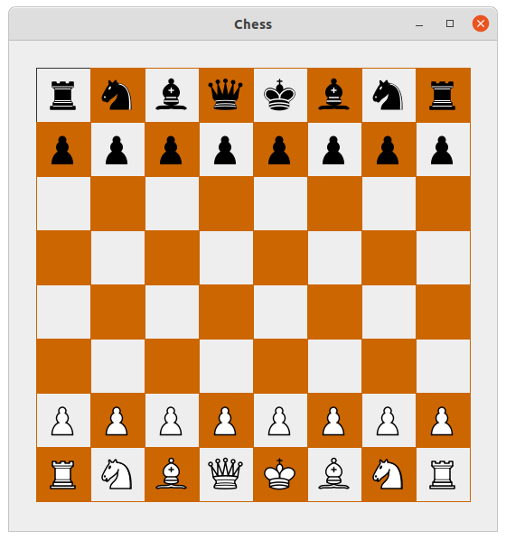
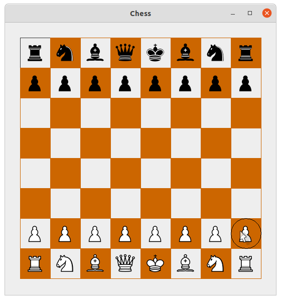

# Chess-Board-Java

The program renders a chessboard with pieces on which you can move chess pieces turn by turn following the chess rules. For now, you cannot take out another player's pieces.

 
